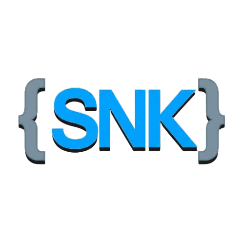

##  Hi there 👋 I'm Shankara Narayanan — Automation Engineer | Java & Playwright Specialist

🌐 **SNK Nexus** –  [Visit Portfolio](https://snk_nexus/)
 

- 🔭 Currently working at **Tata Consultancy Services (TCS)**
- 🌱 Exploring **Advanced Automation Frameworks**, **SDET Practices**, and **CI/CD Integration**

### 🌐 Social Presence

  

### 💻 I Code Automation In

  
  
  

### ⚙️ Automation & Frameworks

### 🛠️ Tools & Platforms

  
  
  
  
  

### 🚀 Enterprise Project Experience

#### 🏭 Enterprise Manufacturing Management System  
Client: **Novelis Inc.**  
Domain: Sustainable Aluminium Manufacturing  

- Designed and executed end-to-end test scenarios.
- Built scalable Selenium (Java + TestNG + Cucumber) automation framework.
- Developed Playwright scripts for cross-browser UI validation.
- Performed ETL validation using Informatica workflows.
- Executed SQL-based backend data verification.
- Contributed to Agile sprint cycles and regression releases.

### 📊 GitHub Stats

### 🧠 Currently Upskilling

📘 Strengthening skills in:
- Advanced Framework Design (POM, DDT, Hybrid)
- API Automation Testing
- CI/CD Pipeline Integration
- SDET Best Practices

✨ Breaking Builds. Preventing Bugs. Delivering Quality.
